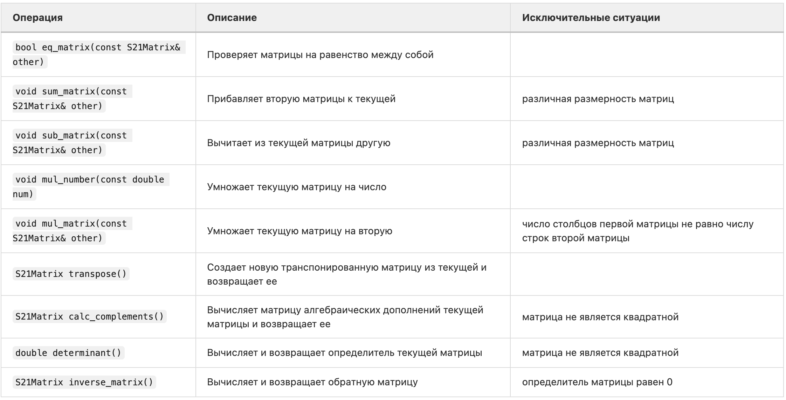

# CPP1_matrix

 Реализовать на языке программирования С++ библиотеку для работы с матрицами,  используя объектно-ориентированный подход. Объектно-ориентированный подход позволяет реализовать библиотеку для работы с матрицами в виде отдельного класса, над объектами которого определены операции, представленные как методами, так и стандартными операторами +, -, *.

## Операции над матрицами

## Конструкторы и деструктор

## Перегрузка операторов

